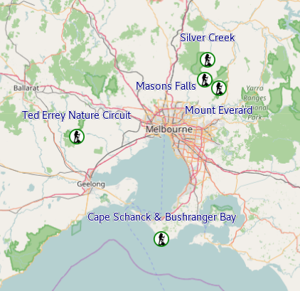

# Maps

## Kinglake National Park (VIC/Australia)

* [Masons Falls loop](kinglakenationalpark/masonsfalls.md) 15.9km (loop)
* [Mount Everard Loop](kinglakenationalpark/mounteverard.md) 18.5km (loop)
* [Silver Creek Long Loop](kinglakenationalpark/silvercreek.md) 13.9km (loop)

## Lerderderg State Park (VIC/Australia)

* Coming

## Mornington Peninsula (VIC/Australia)

* [Cape Schanck and Bushranger Bay](morningtonpeninsula/capeschanckbushrangerbay.md) 12.9km (return)
