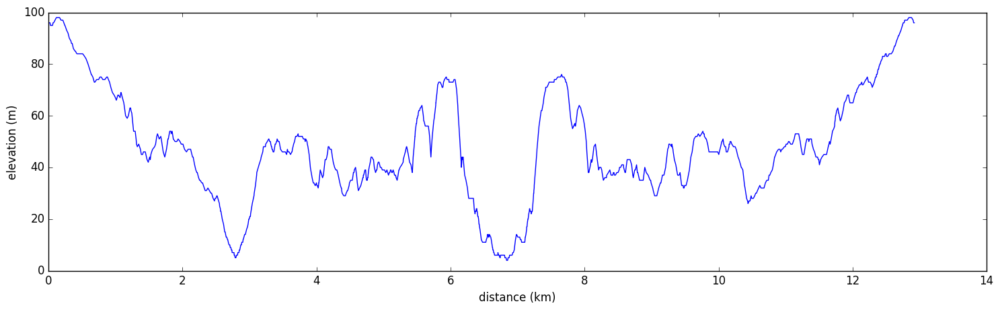

# Cape Schanck and Bushranger Bay

A 12.9km return walk visitinging Cape Schanck and Bushranger Bay starting from the Boneo Road carpark

## Elevation

## Map

[Cape Schanck and Bushranger Bay (500m)](CapeSchanckandBushrangerBay-500m.pdf)

OR scan with *PDF Maps*

